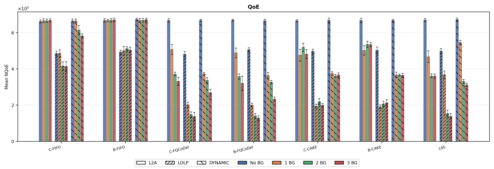
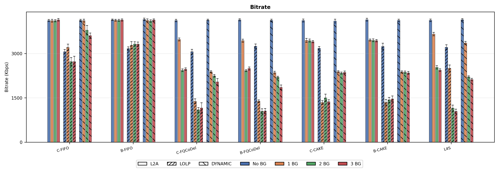
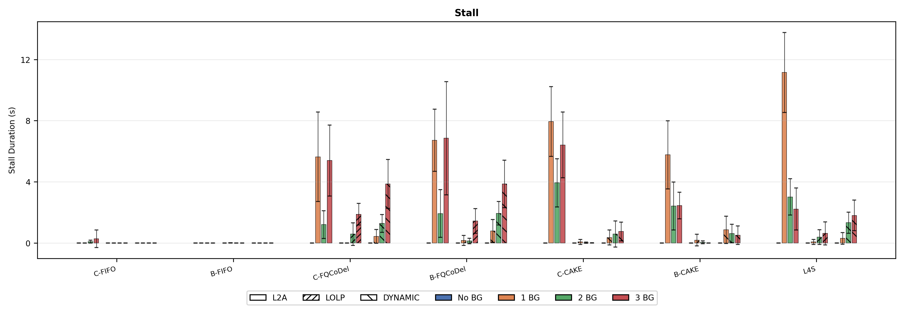
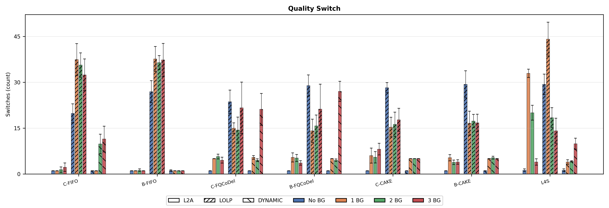
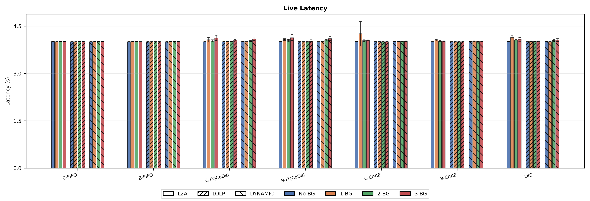
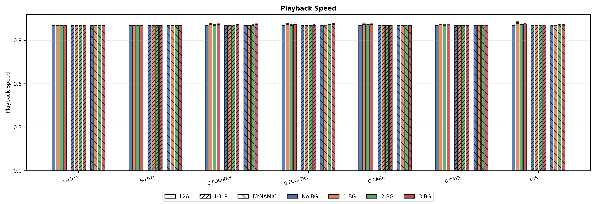
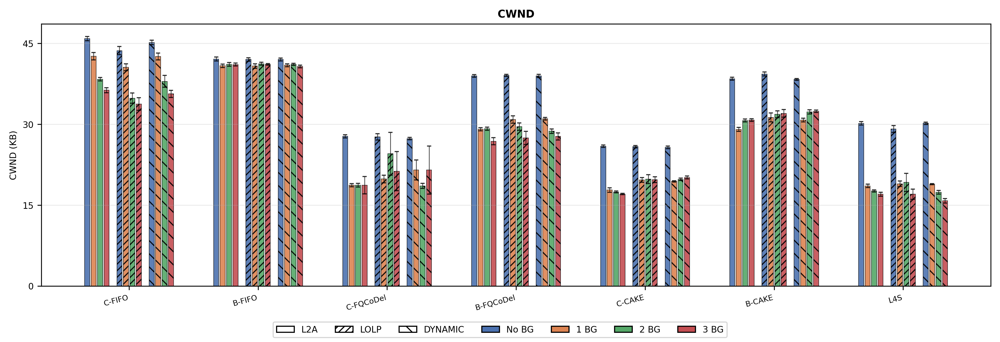
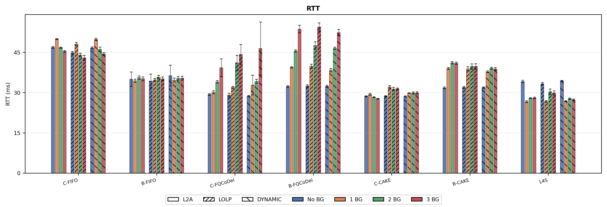
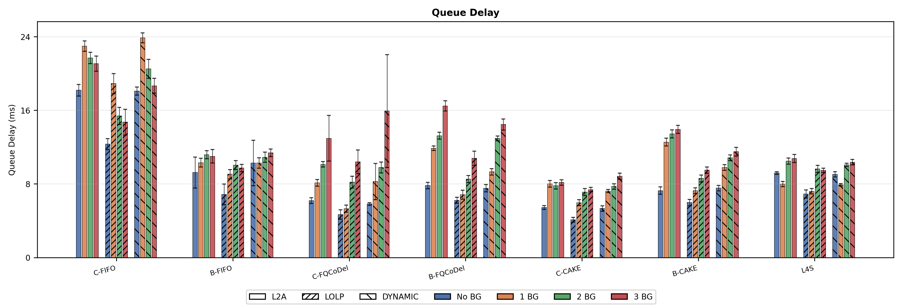
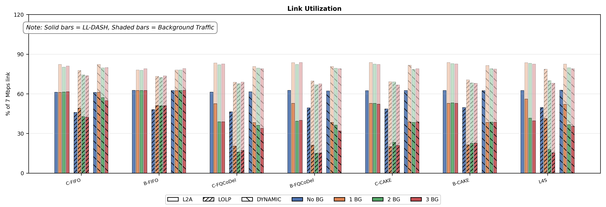

# LL-DASH over QUIC — Evaluation Notes

This is the QUIC counterpart to [`ll_dash_tcp_findings.md`](ll_dash_tcp_findings.md). The network setup, ABR algorithms, CC algorithms, AQM disciplines, bitrate ladder, and background traffic model are identical — refer to that document for full descriptions. This file focuses only on what is **different or new** in the QUIC evaluation.

**Runs:** 10 per configuration (IDs 75–84)

---

## Pipeline

The QUIC implementation injects a custom transport layer between dash.js and livesim2. Unlike the direct TCP path, segments travel over an encrypted QUIC connection managed by **picoquic**, with congestion control running entirely in userspace.

```
Browser          Proxy            QUIC Client      QUIC Server       curl         Livesim2
(dash.js)     (Python:9000)          (C)            (C:4433)       (process)      (Go:8888)
   |                |                 |                 |               |              |
   |─GET /seg.m4s──►|                 |                 |               |              |
   |                |──Forward ID:N──►|                 |               |              |
   |                |                 |──QUIC STREAM───►|               |              |
   |                |                 |                 |──spawn curl──►|              |
   |                |                 |                 |               |──GET /seg───►|
   |                |                 |                 |               |◄─response────|
   |                |                 |                 |◄─pipe bytes───|              |
   |                |                 |◄─QUIC packets───|               |              |
   |                |◄──pipe bytes────|                 |               |              |
   |◄─HTTP stream───|                 |                 |               |              |
```

The QUIC server uses a **pull model**: it opens a non-blocking `curl` pipe to livesim2 and hands it to PicoQUIC's pacing engine via `picoquic_mark_active_stream()`. PicoQUIC reads from the pipe only when its CC/pacing timer fires — ensuring zero application-induced bursts within a single stream.


---

## Implementation note — proxy burst and DualPI2 tuning

Due to our proxy-based architecture, picoquic transmits data in sharp initial bursts. This is especially visible when ABR algorithms such as L2A open multiple QUIC streams concurrently (e.g., video segments, initialization segments, and MPD requests). Because all data is immediately available from the proxy’s pipe, PicoQUIC rapidly drains its congestion window, producing back-to-back packet bursts.

These bursts create significant instantaneous queue buildup and artificial pressure on the AQM. For DualPI2, a tight 1–3 ms `step_thresh` (which worked well for TCP with pacing) is insufficient to absorb these bursts, causing Prague to overreact to ECN marking and collapse its sending rate.

To compensate, we increased the threshold to **20 ms**, providing enough headroom for a single initial congestion window burst and reducing excessive marking.

> This is an implementation artefact of the proxy tunnel, not a fundamental QUIC property. A native HTTP/3 dash.js would not have this overhead.

---

## Results overview

**ABR ordering:** L2A > Dynamic > LoLP in almost all conditions. L2A consistently outperforms LoLP by more aggressively utilizing bandwidth, whereas LoLP remains conservative to preserve stability.

---

## Figures

### 1. QoE

Under FIFO, QUIC appears more aggressive against competing TCP flows, keeping QoE slightly higher than the TCP baseline. However, FQ-CoDel and L4S restore stability across all CCs through flow isolation.

### 2. Bitrate



### 3. Stall Duration



### 4. Quality Switches



### 5. Live Latency



### 6. Playback Speed

L4S and FQ-CoDel keep playback rate closest to 1.0 (no catch-up needed).

### 7. CWND

Under FIFO, QUIC maintains higher CWND across load levels than TCP, reflecting its aggressiveness. FQ-CoDel and L4S enforce tighter CWND bounds.

### 8. RTT

Because QUIC pushes more data and achieves higher bandwidth against TCP flows under FIFO, it causes significantly increased RTT and queue delay compared to the TCP baseline. FQ-CoDel and L4S fix this.

### 9. Queue Delay


### 10. Link Utilization

Under QUIC, C-FIFO and B-FIFO retain a noticeably higher LL-DASH link share against TCP cross-traffic. Under FQ-CoDel and L4S, per-flow isolation results in balanced sharing, reducing the gap between TCP and QUIC.
