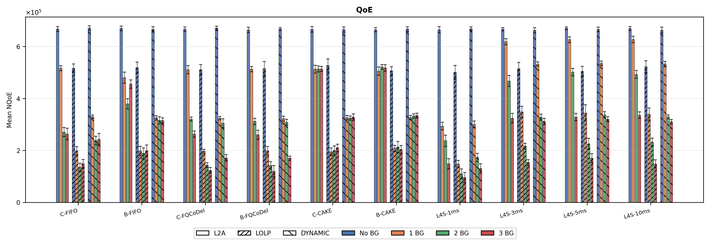
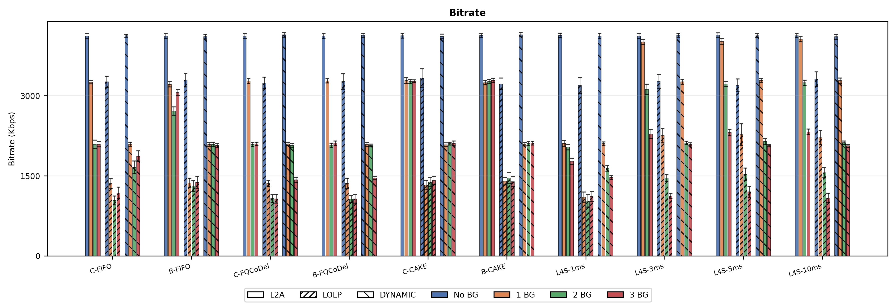
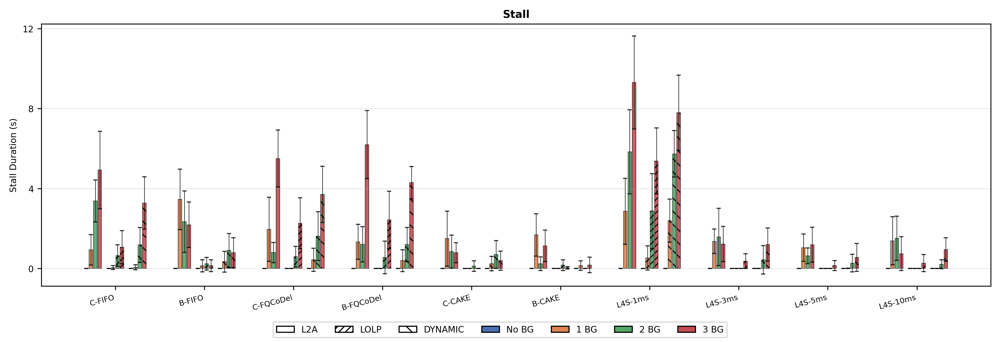
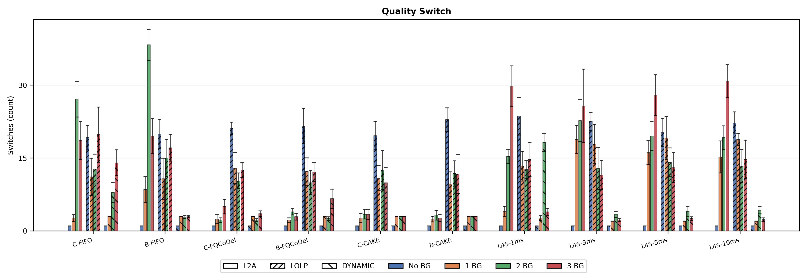
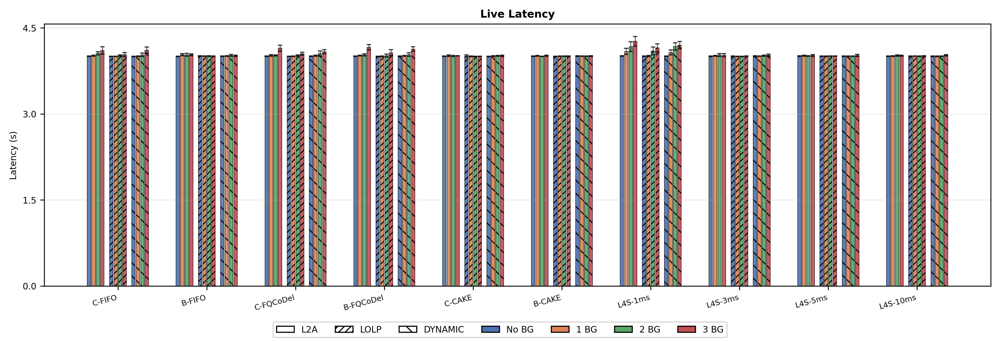
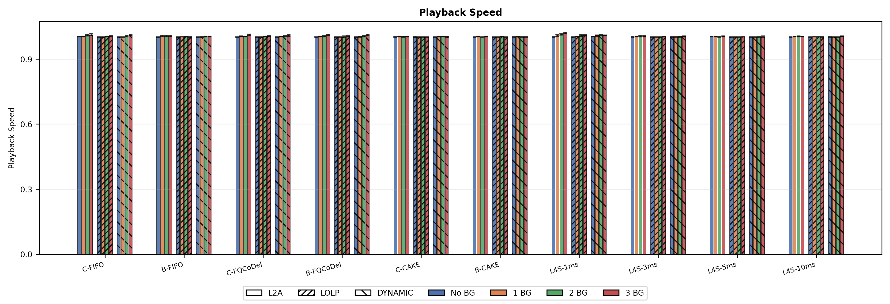
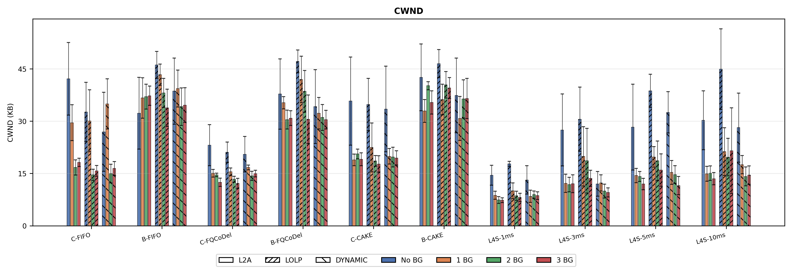
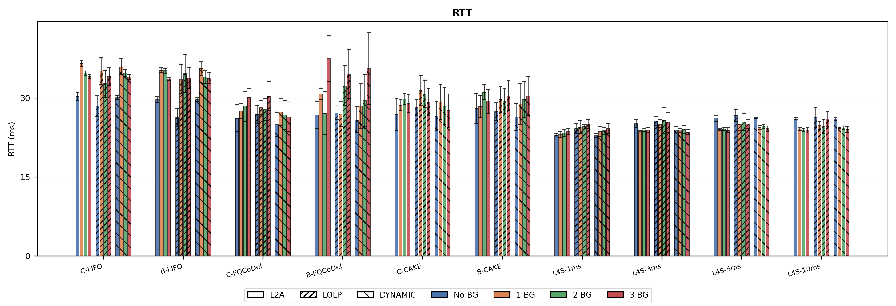
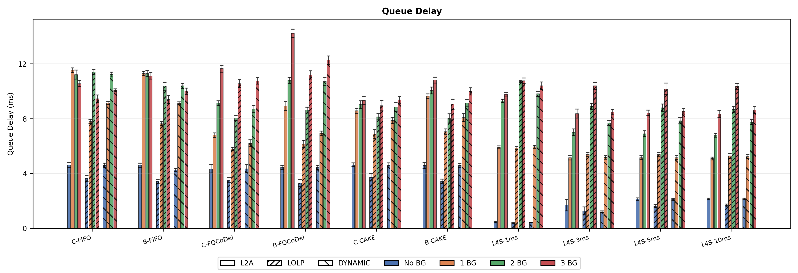
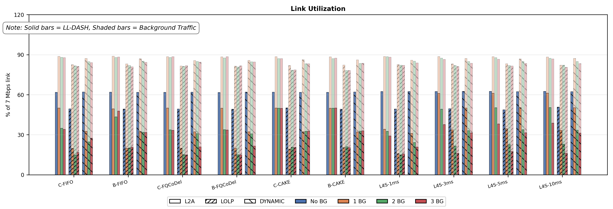

# LL-DASH over TCP — Evaluation Notes

This documents our cross-layer evaluation of Low-Latency DASH streaming over TCP, covering three ABR algorithms, several CC/AQM combinations, and 0–3 background flows. The goal was to understand how transport-layer choices affect QoE in a controlled emulated network.

---

## Setup

The streaming pipeline is straightforward: dash.js fetches segments directly from livesim2 over HTTP/TCP. No QUIC proxy, no middlebox. Segments are delivered using **HTTP/1.1 chunked transfer encoding** — the server pushes each 0.5-second sub-chunk as it becomes available, so the player starts receiving data within the first chunk rather than waiting for the full 2-second segment. This is the standard LL-DASH delivery mechanism.

```
dash.js  →  [bottleneck: tc htb + qdisc]  →  livesim2 (port 8888)
                iperf3 background flows ↗
```

**Network parameters:**
- Bottleneck: 7 Mbps, shaped with `tc htb`
- Base RTT: 20 ms emulated via `tc netem` (10 ms each direction)
- Linux kernel 6.6 with TCP Prague / L4S patches

**Why 7 Mbps and 20 ms?** The top bitrate rung is 4.22 Mbps, so 7 Mbps gives ~2.8× headroom — enough for the video stream plus 1–3 background flows to create meaningful contention. The 20 ms RTT is representative of a typical last-mile link. Together they set the BDP = 17.5 KB (~11 packets at MTU 1500), which we use as the pfifo buffer limit.

**Bitrate ladder (5 levels):** 4.22 / 3.12 / 1.62 / 0.74 / 0.38 Mbps

**Segments:** 2-second chunks, 0.5-second sub-chunks (LL-DASH mode)

**Runs:** 10 per configuration (IDs 80–89)

---

## What we tested

**ABR algorithms** (client-side, in dash.js):
- **L2A** — throughput + buffer aware, relatively aggressive
- **LoLP** — latency-first, conservative bitrate selection
- **Dynamic** — hybrid, balances throughput and latency

**Congestion control:**
- **Cubic** — standard loss-based AIMD; CWND halves on every loss event
- **BBR1** — model-based; probes bandwidth/RTT, less reactive to individual drops
- **Prague** — L4S-capable; uses ECN marks from DualPI2 for smooth rate adjustment

**AQM / queue discipline:**
- **pfifo** — tail-drop FIFO, buffer = 1 BDP
- **fq_codel** — per-flow CoDel; signals congestion via sojourn time before queue fills
- **CAKE** — hierarchical fair queuing, `triple-isolate` mode (see note)
- **DualPI2** — L4S AQM; separate classic and L4S queues, ECN marking

**Background traffic:** 0, 1, 2, or 3 parallel `iperf3` TCP flows from the same host.

**Paper figure x-axis labels:**

| Label | CC | AQM |
|---|---|---|
| C-FIFO | Cubic | pfifo |
| B-FIFO | BBR1 | pfifo |
| C-FCDL | Cubic | fq_codel |
| B-FCDL | BBR1 | fq_codel |
| L4S | Prague | DualPI2 (3 ms) |

---

## A few things worth noting before reading the results

**pfifo at 1 BDP is not bufferbloat.** With only ~11 packets of buffer, the queue fills almost instantly once background flows start competing. What happens next is tail-drop: every new packet is discarded when the queue is full. Cubic reacts to each drop by halving its CWND (AIMD), which creates a classic sawtooth throughput pattern — build up, drop, collapse, recover. The DASH player's bandwidth estimator sees this oscillation and makes poor quality decisions. The degradation in the C-FIFO case is **loss-induced throughput collapse**, not latency inflation from a large queue.

**CAKE underperforms FQ-CoDel here, but that's a testbed artifact.** CAKE's `triple-isolate` mode provides fairness at the *host-pair* level. Since all background flows come from the same `iperf3` host, CAKE treats them as one entity and gives that entity a fair share — effectively the same as the single DASH flow. With 3 background flows from the same host, CAKE hands ~50% of the link to them collectively, which is still aggressive from the DASH perspective. FQ-CoDel hashes per 5-tuple, so each iperf3 flow gets its own slot, which limits each individual flow's share more effectively in this configuration. If background flows came from separate hosts, CAKE would likely behave much closer to FQ-CoDel.

**DualPI2 `step_threshold` is the L4S-queue delay target** (not the classic queue). We tested 1 ms (default), 3 ms, 5 ms, and 10 ms. At 1 ms, the very tight L4S delay target triggers ECN marks far too frequently — Prague backs off even under light load, causing underutilization. At 3 ms the balance is good: Prague gets a clear congestion signal only when warranted, and QoE/latency results are noticeably better. At 5 and 10 ms the results are still reasonable but with slightly less latency benefit. **All L4S results in the paper use the 3 ms configuration.**

> **One global note before the results:** across all figures, DualPI2 with the default 1 ms `step_threshold` (L4S-1ms) consistently performs the worst among all L4S variants — in some cases approaching pfifo-level degradation. This is not a fundamental L4S weakness but a consequence of the 1 ms target being too tight for our 20 ms base RTT setup, leading to near-continuous ECN marking. Keep this in mind when reading any figure that includes L4S results: the 3 ms variant is the representative one; the 1 ms default is included to show the sensitivity of DualPI2 tuning.

---

## Results overview

| CC × AQM | QoE | Latency | Queue Delay | CWND | Notes |
|---|---|---|---|---|---|
| Cubic + pfifo | 🔴 | 🔴 | 🔴 | 🔴 sawtooth | Loss-induced CWND collapse; AIMD saw-tooth pattern |
| BBR1 + pfifo | 🟡 | 🟡 | 🟡 | 🟡 stable | More stable than Cubic, still FIFO-limited |
| Cubic + FQ-CoDel | 🟡 | 🟢 | 🟢 | 🟡 moderate | AQM makes a big difference |
| BBR1 + FQ-CoDel | 🟢 | 🟢 | 🟢 | 🟢 controlled | Good combination overall |
| Prague + DualPI2 (3 ms) | 🟢 | 🟢 | 🟢 | 🟢 tightest | ECN-guided; minimal queue build-up |
| Prague + DualPI2 (1 ms) | 🔴 | 🟡 | 🟡 | 🔴 underused | Over-marking; Prague under-sends even at low load |
| Cubic/BBR1 + CAKE | 🟡 | 🟡 | 🟡 | 🟡 | Testbed artifact — same-host BG traffic |

**ABR ordering by QoE:** L2A > Dynamic > LoLP in almost all conditions. LoLP's conservatism hurts its bitrate reward term in the QoE formula, even when it does reduce stall or latency. Dynamic bridges the gap reasonably well.

---

## Figures


### 1. QoE

Mean QoE per configuration. Higher is better. Shows how L4S and FQ-CoDel preserve QoE under load while Cubic + pfifo degrades sharply past 1 BG flow.

### 2. Bitrate

Average delivered bitrate. L2A and Dynamic stay higher under load; LoLP is consistently conservative.

### 3. Stall Duration

Total rebuffering time. Rises steeply for FIFO configs under 2–3 BG flows due to tail-drop losses triggering TCP backoff.

### 4. Quality Switches

Number of bitrate representation switches. Stable transport (L4S, FQ-CoDel) keeps the bandwidth estimate stable → fewer switches.

### 5. Live Latency

End-to-end latency from live edge to player. L4S delivers the lowest and most consistent latency. FIFO configs under load show large spikes.

### 6. Playback Speed

Player adjusts speed to recover toward the live edge. Large deviations from 1.0 indicate the player is struggling to maintain target latency.

### 7. CWND

Server-side congestion window. Prague + DualPI2 holds a tightly controlled CWND guided by ECN. Cubic + pfifo shows the sawtooth pattern from repeated loss events.

### 8. RTT

Mean RTT during streaming. Under 2–3 BG flows, pfifo configurations show elevated RTT from bursty retransmissions; FQ-CoDel and L4S keep it close to the 20 ms baseline.

### 9. Queue Delay

Queuing delay estimated from backlog using Little's Law, applied uniformly across all AQMs for a fair comparison:

$$\text{delay (ms)} = \frac{\text{backlog (bits)}}{7{,}000{,}000} \times 1000$$

### 10. Link Utilization

Solid bars = DASH share; lighter stacked portion = background traffic. Under Cubic + pfifo with 2–3 BG flows, the DASH share collapses. FQ-CoDel and L4S maintain a much more consistent DASH share.

---

## What we'd like to do next

Two extensions we plan to explore:

**BBR3** — BBRv3 has improved bandwidth estimation and lower queue occupancy compared to BBR1. It would be interesting to see whether the gains at the CC layer translate into measurable QoE improvements in the LL-DASH context, particularly with FQ-CoDel and DualPI2.

**CAKE with separate background hosts** — the current CAKE results reflect a testbed limitation, not a fundamental CAKE weakness. Re-running with distinct source machines for background traffic would give a cleaner picture of CAKE's actual per-flow AQM behaviour and let us compare it more fairly against FQ-CoDel and DualPI2.
